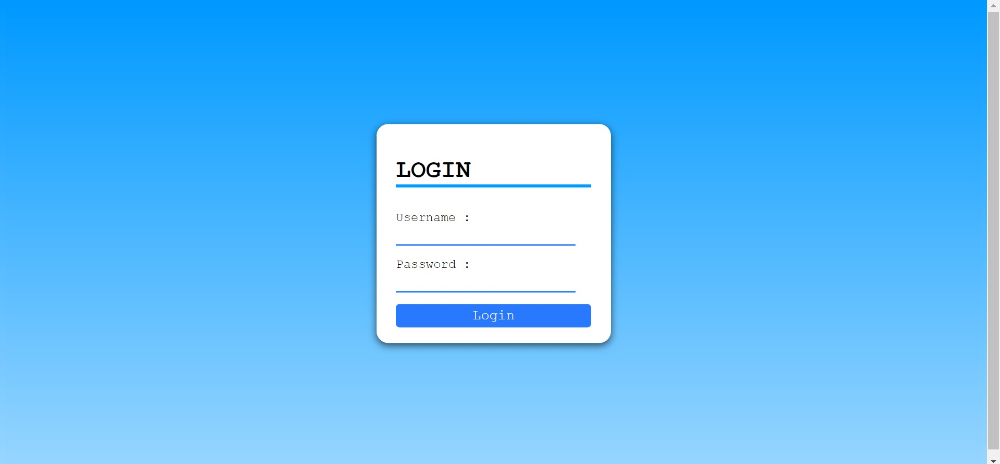
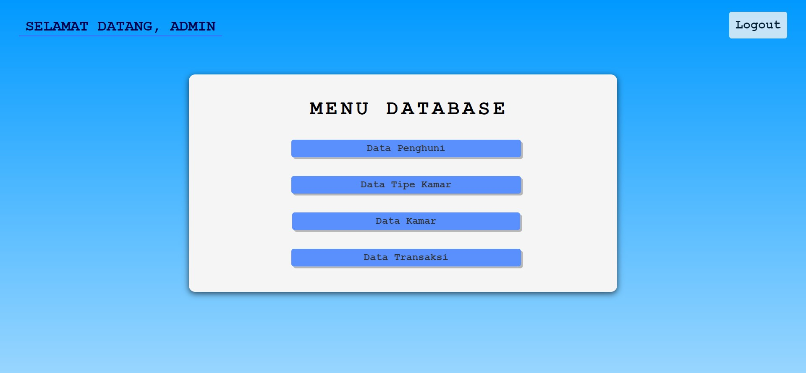
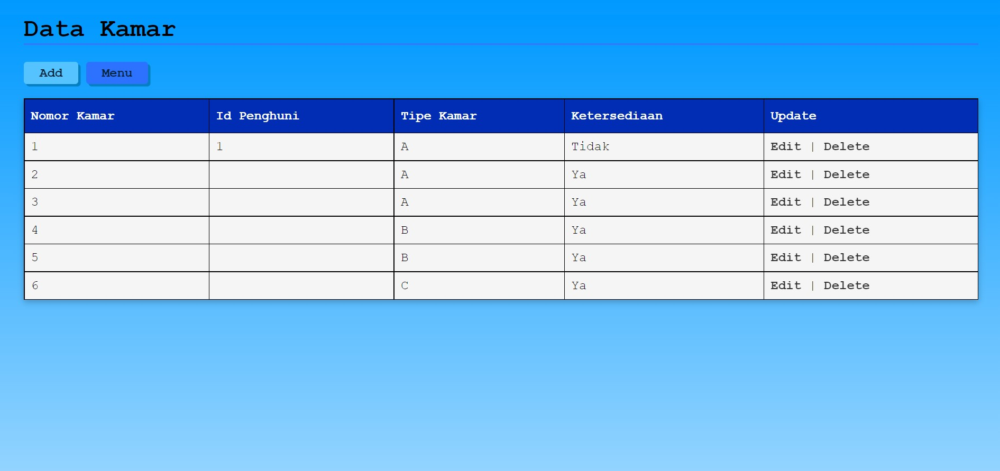

# Tugas Akhir Basdat

## Anggota Kelompok

<table>
  <tr>
    <th>Nama</th>
    <th>NIM</th>
  </tr>
  <tr>
    <td>Albarra Zikrillah</td>
    <td>G6401201023</td>
  </tr>
  <tr>
    <td>Muchammad Gema Akbar</td>
    <td>G6401201071</td>
  </tr>
  <tr>
    <td>Shabrina Basyasyah</td>
    <td>G6401201076</td>
  </tr>
  <tr>
    <td>Christy Octaviani Hutapea</td>
    <td>G6401201082</td>
  </tr>
</table>

## MyKos

**MyKos** adalah aplikasi administrasi yang ditujukan khusus untuk pengelola kamar kos.
Aplikasi ini dibuat untuk membantu para pemilik indekos dalam pendataan penyewa, kamar, dan transaksi sehingga para pemilik yang menggunakan aplikasi berbasis website 
ini dapat menjalankan pekerjaan mereka dengan lebih terstruktur.

## Tampilan Aplikasi
>Halaman Login

  

>Halaman Menu

  

>Halaman Data Kamar

  

